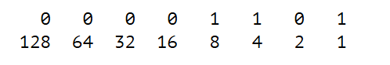

# javaScript
Practica de javaScript junto con el libro eloquentjavascript.

[Libro](https://www.eloquentjavascript.es/)

## Indice
[Capitulo 1](#capitulo-1)

[Capitulo 2](#capitulo-2)

---

# Capitulo 1
El 13 en bits


### Los valores
Se guardas en una parte de la memoria (variables).

### Los números
Tipo `number`. Ejemplo: `13`
Tambien los fraccionarios con un ".". Ej. `9.81`

¿Que se puede hacer con los números?

#### Aritmetica
Operaciones aritméticas como +, -, *, /, % (residuo).

```js
console.log(314 % 100)
```

**Precedencia**: / igual al *, luego + igual al -. Al igual precedencia se aplica de izquierda a derecha.

#### Números especiales
Como `Infinity` y `-Infinity`. También `NaN` 'no es un número' pero es de tipo numerico.
```js
console.log(0/0)
console.log(Infinity - Infinity)
```

### Cadenas
Son textos:
```js
`En el mar`
"Acostado en el océano"
'Flotando en el océano'
```
Saltos de líneas de usa dentro de `. El \ es para escapar. Por ejemplo tambien el \n como salto de línea y \t tabulacion.
```js
"Un carácter de nueva línea se escribe como \"\\n\"."
```
Para concatenar es con +:
```js
"con" + "cat" + "e" + "nar"
```
Especialidad de ``:
```js
»`la mitad de 100 es ${100 / 2}`
» la mitad de 100 es 50
```
${} resultado se convertirá en cadena.

### Operadores unarios
Un operador con palabras 
```js
console.log(typeof 4.5)
// → number
console.log(typeof "x")
// → string
```
Operadores binarios como el - porque puede tener 2 usos.
```js
console.log(- (10 - 2))
// → -8
```

### Valores Boleanos
`true o false`

#### Comparacion
```js
console.log(3 > 2)
// → true
console.log(3 < 2)
// → false
```
o las cadenas que tambien se comparan y se debe tener en cuenta que "las letras mayusculas son siempre menores a las letras minusculas"
```js
console.log("Aardvark" < "Zoroaster")
// → true
```
Otros operadores similares son:
- \>= (mayor o igual que)
- <= (menor o igual que)
- == (igual a)
- != (no igual a).

Pilas esto da false:
```js
console.log(NaN == NaN)
// → false
```

#### Operadores lógicos
- and (y) que es &&
- or (o) que es ||
- not (no) que es !

"**!true** produce false y **!false** produce true"

El orden de precedencia es de menor a mayor:
- ||
- &&
- Comparación como >, ==
y así sucesivamente.
`1 + 1 == 2 && 10 * 10 > 50`

El operadors lógico ternario es: `?:` y se aplica en:
```js
console.log(true ? 1 : 2);
// → 1
console.log(false ? 1 : 2);
// → 2
```

### Valores vacios
son `null` y `undefined`. Son valores que no llevan valor. Ausencia de valor significativo. El `undefined` es porque la operación tiene que devolver algun valor.

### Conversion automática de tipos
Coercion de tipos
- null -> 0
- de cadena a número con el signo -
- de número a cadena con el signo +
```js
console.log(8 * null)
// → 0
console.log("5" - 1)
// → 4
console.log("5" + 1)
// → 51
console.log("five" * 2)
// → NaN
console.log(false == 0)
// → true
```
y tambien
```js
console.log(null == undefined);
// → true
console.log(null == 0);
// → false
console.log(0 == false) // true
console.log("" == false) // true
"" === false // false
```
Para no convertir valores de tipo, mejor usar `===` y `!==`.

#### Cortocircuito de valores lógicos
Imprimiendo lo que es true
```js
console.log(null || "usuario")
// → usuario
console.log("Agnes" || "usuario")
// → Agnes
```
> Las reglas para convertir cadenas y números en valores Booleanos establecen que 0, NaN y la cadena vacía ("") cuentan como false, mientras que todos los demás valores cuentan como true. Esto significa que 0 || -1 produce -1, y "" || "!?" da como resultado "!?".


```js
console.log(0 || 100);
// → 100
console.log(0 ?? 100);
// → 0
console.log(null ?? 100);
// → 100
```

El operador ?? devuelve el valor de la derecha solo si el de la izquierda es null o undefined.

> El operador && funciona de manera similar pero en sentido contrario. Cuando el valor a su izquierda es algo que se convierte en false, devuelve ese valor, y de lo contrario devuelve el valor de su derecha.

```js
// Cortocircuito de valores lógicos
console.log(true || false); // true

let nombre = null;
var usuario = nombre || "Invitado";
console.log(usuario); // "Invitado"

console.log(false && true); // false

var usuario = "Josser";
let acceso = usuario && "Acceso permitido";
console.log(acceso); // "Acceso permitido"

let edad = 0;
let valor = edad ?? 18;
console.log(valor); // 0

let edad2 = null;
let valor2 = edad2 ?? 18;
```

# Capitulo 2
Una expresion es como un fragmento de una oración.

Una declaración de JavaScript es como una oración completa.

Un programa es una lista de declaraciones.

Una declaración termina con ";" al final.
```js
1;
!false;
```

## Enlaces o variable
Atrapar y retener valores
```js
let caught = 5 * 5;
```
Con `let` es para definir el enlace, `caugth` es el nombre del enlace o variable y lo demás es la asignación del valor. Ahora ese nombre es una expresión.
```js
let ten = 10;
console.log(ten * ten);
// → 100
```
Si creas un enlace y no lde das valor, este por defecto es `undefined`.

También `let` puede definir múltiples enlaces.
```js
let one = 1, two = 2;
console.log(one + two);
// → 3
```
También para crear estos enlaces se usa `var` y `const`.
```js
var name = "Ayda";
const greeting = "Hola ";
console.log(greeting + name);
// → Hola Ayda
```
`var` se usaba antes de 2015, pero en algunas ocasiones se puede usar porque se comporta extrañamente el algunas situaciones (Google Apps Scripts).

`const` para definir un enlace constante (que no cambiará).

## Nombres de enlaces
Se puede usar una o mas letras, también digitos pero no al inicio, y los signos pueden ser `$` o `_` solamente.

Las palabras reservadas son:
```js
break case catch class const continue debugger default
delete do else enum export extends false finally for
function if implements import interface in instanceof let
new package private protected public return static super
switch this throw true try typeof var void while with yield
```

## El entorno
Es la colección de enlaces y valores

## Funciones
Fragmento de programa envuelto en un valor. `prompt` es un ejemplo y crea un cuadro de dialogo para recibir una entrada. Ejecutar una función se llama invocar, llamar, o aplicar una función.

A la función se le pasan los argumentos.

## La función console.log
```js
let x = 30;
console.log("el valor de x es", x);
// → el valor de x es 30
```

## Valores de retorno
Ej. La función Math.max toma cualquier cantidad de argumentos numéricos y devuelve el mayor:
```js
console.log(Math.max(2, 4));
// → 4
console.log(Math.min(2, 4) + 100);
// → 102
```

## Control de flujo
>Las sentencias se ejecutan como si fueran una historia, de arriba hacia abajo. 


```js
let elNumero = Number(prompt("Elige un número"));
console.log("Tu número es la raíz cuadrada de " + elNumero * elNumero);
```

## Ejecución condicional
>La ejecución condicional se crea con la palabra clave if en JavaScript. En el caso simple, queremos que cierto código se ejecute si, y solo si, una cierta condición es verdadera.


```js
let elNumero = Number(prompt("Elige un número"));
if (!Number.isNaN(elNumero)) {
  console.log("Tu número es la raíz cuadrada de " + elNumero * elNumero);
}
```
o también:
```js
if (1 + 1 == 2) console.log("Es verdad");
// → Es verdad
```

>A menudo no solo tendrás código que se ejecuta cuando una condición es verdadera, sino también código que maneja el otro caso. Esta ruta alternativa está representada por la segunda flecha en el diagrama.

```js
let elNumero = Number(prompt("Elige un número"));
if (!Number.isNaN(elNumero)) {
  console.log("Tu número es la raíz cuadrada de " + elNumero * elNumero);
} else {
  console.log("Oye. ¿Por qué no me diste un número?");
}
```
O pueden existir varios caminos.


```js
let num = Number(prompt("Escoge un número"));

if (num < 10) {
  console.log("Pequeño");
} else if (num < 100) {
  console.log("Mediano");
} else {
  console.log("Grande");
}
```

## Bucles while y do
Es una forma de control llamada bucle representada con:


Nos permite regresar en un punto del programa y repetirlo.

```js
let numero = 0;
while (numero <= 12) {
  console.log(numero);
  numero = numero + 2;
}
// → 0
// → 2
//   … etcétera
```
>El bucle do siempre ejecuta su cuerpo al menos una vez, y comienza a probar si debe detenerse solo después de esa primera ejecución.

```js
let tuNombre;
do {
  tuNombre = prompt("¿Quién eres?");
} while (!tuNombre);
console.log("Hola " + tuNombre);
```

## Sangrado de código
No son necesarios en JS, solo se usan para que la estructura del código resalte para los lectores humanos. El programa puede incluso en una sola línea.

## Bucles For